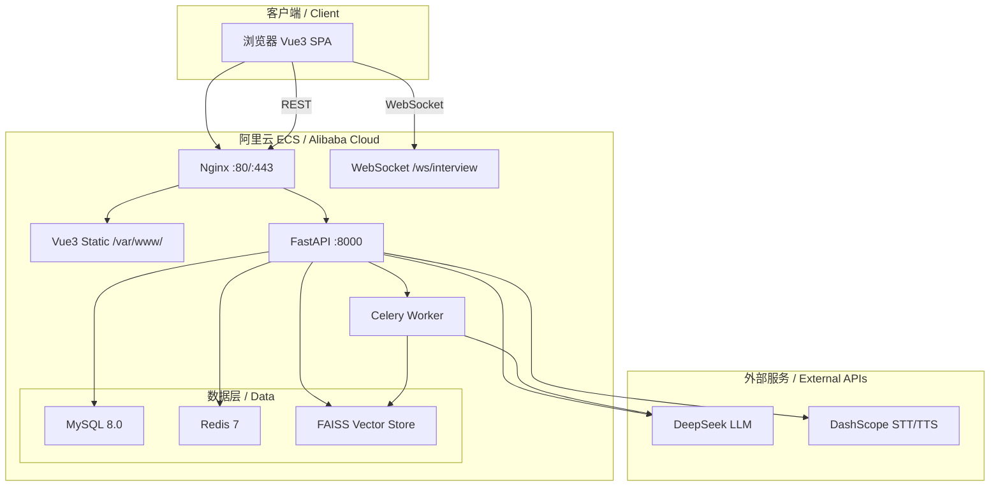
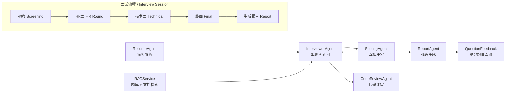

<p align="center">
  
  
  
  
  
</p>

<h1 align="center">AI面试官 / AI Interviewer</h1>

<p align="center"><strong>AI 驱动的模拟面试平台 — 语音交互、多阶段面试、实时评分、详尽报告</strong></p>
<p align="center"><strong>AI-powered mock interview platform with real-time voice, live scoring, and detailed reports.</strong></p>

<p align="center">
  <a href="https://www.aiview.pandahead.top"><strong>Live Demo</strong></a>
</p>

---

## 面试流程 / Interview Flow

```
用户上传简历 → 粘贴JD（可选）→ 选择岗位/难度 → AI 多阶段面试 → 生成评估报告
  Resume        JD (optional)        Position/diff    4-stage interview      Report
```

1. **准备** — 上传简历，可选粘贴 JD 做针对性面试；AI 解析技能标签，锁定岗位
2. **面试** — 四阶段推进：初筛 → HR面 → 技术面 → 终面，WebSocket 实时双向通信
3. **评分** — 每题答完即时五维评分，阶段结束自动汇总
4. **报告** — 综合得分、雷达图、错误分类（事实错误/深度不足）、逐题改进建议、JD 匹配度

1. **Prepare** — Upload resume, optionally paste a JD; AI extracts skills and locks position
2. **Interview** — 4 stages: Screening → HR → Technical → Final, real-time WebSocket communication
3. **Score** — 5-dimension scoring after each answer, summarized per stage
4. **Report** — Overall score, radar chart, error classification, per-question suggestions, JD match

---

## 功能亮点 / Features

| | |
|---|---|
| 语音面试 Voice Interview | 按住说话 → STT → LLM → TTS 播回，15 分钟会话 |
| 四阶段流程 4-Stage Pipeline | 初筛 → HR面 → 技术面 → 终面，差异化出题策略 |
| 在线编程 Live Coding | Monaco Editor + AI 代码评审（正确性/性能/可读/安全） |
| 五维度评分 5-Axis Scoring | 技术深度/广度/工程化思维/沟通逻辑/岗位匹配度 |
| 详细报告 Reports | ECharts 雷达图 + 错误解析 + 逐题改进建议 |
| JD 分析 JD Analysis | 粘贴招聘 JD → LLM 提取岗位/技能 → 针对性出题 → JD 匹配度 |
| 简历解析 Resume Parsing | PDF/DOCX 文本提取 + 技能识别 + 岗位匹配 |
| RAG 增强 RAG | FAISS 向量库 + 题库检索，manual 题目 20 分优先 |
| 题库回流 Question Feedback | 高分面试题目自动入库（source=auto），trigram 去重 |
| 管理后台 Admin Panel | 题库 CRUD / 用户管理 / 文档管理 / 邀请码 |
| 断线重连 Reconnection | WebSocket 断开自动恢复，对话历史 + 倒计时 + 状态完整还原 |
| 主题切换 Theme | 浅色 / 深色 / 暖色三主题，localStorage 持久化 |

---

## 技术栈 / Tech Stack

| Layer | Technology |
|-------|-----------|
| Backend | FastAPI (Python 3.12) |
| Frontend | Vue 3 + Vite + Element Plus |
| Database | MySQL 8.0 + Redis 7 |
| LLM | DeepSeek API (via LangChain ChatOpenAI) |
| Voice | DashScope Qwen (ASR-Realtime / TTS) |
| Embeddings | sentence-transformers (BAAI/bge-small-zh-v1.5) + FAISS |
| Browser VAD | onnxruntime-web + Silero VAD |
| Async Tasks | Celery (Redis broker) |
| Deployment | Docker Compose + Nginx + Let's Encrypt |

---

## 系统架构 / System Architecture



## Agent 流水线 / Agent Pipeline



---

## 项目结构 / Project Structure

```
AI_Interview/
├── FastAPI_ai_interview/          # 后端 Backend
│   ├── app/
│   │   ├── agents/                # LLM Agent（6个）
│   │   │   ├── base.py            #   BaseAgent — ChatOpenAI 封装
│   │   │   ├── interviewer_agent.py # InterviewerAgent — 出题 + 追问
│   │   │   ├── scoring_agent.py   #   ScoringAgent — 五维评分
│   │   │   ├── report_agent.py    #   ReportAgent — 报告生成
│   │   │   ├── resume_agent.py    #   ResumeAgent — 简历解析
│   │   │   └── code_review_agent.py # CodeReviewAgent — 代码评审
│   │   ├── services/              # 业务逻辑 Business logic
│   │   │   ├── interview_orchestrator.py   # 面试状态机（默认编排器）
│   │   │   ├── langgraph_orchestrator.py   # LangGraph 编排器（可选）
│   │   │   ├── rag_service.py              # FAISS + 题库混合检索
│   │   │   ├── scoring_service.py          # 评分封装
│   │   │   ├── report_generator.py         # 报告编排 + 回流触发
│   │   │   ├── question_feedback_service.py # 题库自动回流 + 去重
│   │   │   ├── resume_parser.py            # PDF/DOCX 解析
│   │   │   ├── vector_store.py             # FAISS 向量存储
│   │   │   ├── captcha_service.py          # 短信验证码
│   │   │   └── web_search.py               # 联网搜索（Serper/Tavily）
│   │   ├── api/
│   │   │   ├── v1/                # REST 路由
│   │   │   │   ├── auth.py        #   登录/注册/刷新令牌
│   │   │   │   ├── interviews.py  #   面试 CRUD + 重连 + 收藏
│   │   │   │   ├── resumes.py     #   简历上传/解析
│   │   │   │   ├── messages.py    #   留言板
│   │   │   │   ├── feedback.py    #   评分纠错
│   │   │   │   ├── captcha.py     #   短信验证码
│   │   │   │   └── admin/         #   管理后台（题库/用户/文档）
│   │   │   └── deps.py            #   依赖注入（get_current_user / require_admin）
│   │   ├── models/                # SQLAlchemy ORM（8 张表）
│   │   ├── ws/                    # WebSocket + 音频处理
│   │   │   ├── interview_ws.py    #   面试主通道
│   │   │   ├── session_manager.py #   Redis 会话管理
│   │   │   └── audio_handler.py   #   STT/TTS 中转
│   │   ├── core/                  # 基础设施
│   │   │   ├── config.py          #   环境配置（Pydantic Settings）
│   │   │   ├── database.py        #   异步 SQLAlchemy 引擎
│   │   │   ├── security.py        #   JWT + bcrypt + Token 吊销
│   │   │   ├── middleware.py       #   CORS / 限流 / 日志
│   │   │   ├── exceptions.py      #   自定义异常 + 全局处理器
│   │   │   └── logging_config.py  #   统一日志格式
│   │   └── schemas/               # Pydantic 请求/响应模型
│   ├── alembic/                   # 数据库迁移
│   ├── docker-compose.yml         # MySQL + Redis + Backend + Celery
│   ├── Dockerfile
│   └── .env.example
│
├── vue_ai_interview/              # 前端 Frontend
│   ├── src/
│   │   ├── views/                 # 页面 Pages（8个）
│   │   │   ├── DashboardPage.vue  #   首页 — 上传简历 / 岗位 / JD 分析
│   │   │   ├── InterviewRoom.vue  #   面试间 — 语音 Q&A + 代码编辑器
│   │   │   ├── ReportPage.vue     #   报告页 — 雷达图 + 逐题分析
│   │   │   ├── MessagePage.vue    #   留言板 — 独立全页
│   │   │   ├── LoginPage.vue      #   登录
│   │   │   ├── RegisterPage.vue   #   注册
│   │   │   ├── ForgotPasswordPage.vue # 忘记密码
│   │   │   └── admin/             #   管理后台页面
│   │   ├── components/            # 通用组件（10个）
│   │   │   ├── AppLayout.vue      #   全局布局 + 底部 Tab
│   │   │   ├── MessageBoard.vue   #   留言板浮动面板
│   │   │   ├── AIStatusIndicator.vue  # AI 状态指示灯
│   │   │   ├── AudioWaveform.vue  #   音频波形动画
│   │   │   ├── CodeEditorPanel.vue #   Monaco 代码编辑器
│   │   │   ├── CountdownTimer.vue #   倒计时
│   │   │   ├── StageTransition.vue #  阶段切换动画
│   │   │   ├── GuideCard.vue      #   引导提示卡
│   │   │   ├── NetworkStatus.vue  #   网络状态指示
│   │   │   └── ProtectedRoute.vue #   路由鉴权守卫
│   │   ├── composables/           # 组合函数 Composables（6个）
│   │   │   ├── useInterview.js    #   面试状态机核心
│   │   │   ├── useWebSocket.js    #   WebSocket 生命周期 + 重连
│   │   │   ├── useAudioRecorder.js #  浏览器录音
│   │   │   ├── useSileroVAD.js    #   语音活动检测
│   │   │   ├── useReport.js       #   报告数据
│   │   │   └── useTheme.js        #   主题切换
│   │   ├── stores/                # Pinia 状态管理
│   │   │   ├── authStore.js       #   认证状态
│   │   │   └── interviewStore.js  #   面试状态
│   │   └── services/              # API 封装
│   │       ├── api.js             #   Axios 实例 + 拦截器
│   │       ├── authService.js     #   认证 API
│   │       ├── interviewService.js #  面试 API
│   │       ├── resumeService.js   #   简历 API
│   │       └── adminService.js    #   管理 API
│   ├── vite.config.js
│   └── package.json
│
├── 项目文档.md                     # 技术文档（API / 数据库 / 设计）
├── 开发日志.md                     # 开发记录（本地）
├── 联桥日志.md                     # 前后端联桥排查（本地）
├── 部署指南.md                     # 部署步骤 + 踩坑录（本地）
└── README.md                       # 本文件
```

---

## 核心 Agent / Core Agents

| Agent | 中文名 | 职责 | 技术细节 |
|-------|--------|------|----------|
| `ResumeAgent` | 简历分析 | 从简历文本提取结构化信息（技能/学历/项目），计算岗位匹配度 | `llm_call_json()` 输出结构化 JSON |
| `InterviewerAgent` | 面试官 | 根据简历 + 岗位 + JD + RAG 检索结果生成问题，处理追问和阶段推进 | `llm_call_json()` + `experience_level` / `jd_requirements` 注入 |
| `ScoringAgent` | 评分官 | 五维评分 + 错误分类（事实错误/深度不足/沟通问题） | `llm_call_json()` → `ScoringResponse` schema |
| `CodeReviewAgent` | 代码评审 | 评审正确性、性能、可读性、安全性，输出改进代码 | `llm_call_json()` → 4 维评审 + 改进版代码 |
| `ReportAgent` | 报告生成 | 综合评分、雷达图数据、逐题分析、JD 匹配度、改进建议 | `llm_call()` 生成 Markdown 报告 |
| `BaseAgent` | 基类 | 封装 `ChatOpenAI`（DeepSeek），提供 `llm_call()` / `llm_call_json()` + JSON 修复 | `langchain_openai.ChatOpenAI` |

---

## 权限模型 / Permission Model

| 操作 | 普通用户 User | 管理员 Admin |
|------|:---:|:---:|
| 上传简历、创建面试 | ✅ | ✅ |
| 面试作答、查看报告 | ✅ | ✅ |
| 发表留言 | ✅ | ✅ |
| 删除自己的留言 | ✅ | ✅ |
| 删除任意留言 | ❌ | ✅ |
| 题库管理（增删改） | ❌ | ✅ |
| 用户管理（列表/禁用） | ❌ | ✅ |
| 文档/RAG 管理 | ❌ | ✅ |
| 邀请码生成 | ❌ | ✅ |

管理员通过数据库 `users.role = 'admin'` 设置，后端通过 `require_admin` 依赖注入校验。留言删除逻辑同时允许作者本人操作（`user_id` 匹配或 `role == 'admin'`）。

Admin access is set via `users.role = 'admin'` in the database and enforced by the `require_admin` FastAPI dependency. Message deletion allows both the author and any admin.

---

## API 概览 / API Overview

| Module | Method | Path | Description |
|--------|--------|------|-------------|
| Auth | POST | `/api/auth/register` | 注册（邀请码 + 短信 + 密码） |
| Auth | POST | `/api/auth/login` | 登录，返回 JWT 对 |
| Auth | POST | `/api/auth/refresh` | 刷新 access token |
| SMS | POST | `/api/captcha/send` | 发送短信验证码 |
| SMS | POST | `/api/captcha/verify` | 校验短信验证码 |
| Resume | POST | `/api/resumes/upload` | 上传并解析简历 |
| Resume | GET | `/api/resumes/{id}` | 简历详情 |
| Interview | POST | `/api/interviews` | 创建面试 |
| Interview | POST | `/api/interviews/analyze-jd` | JD 分析 |
| Interview | GET | `/api/interviews/history` | 面试历史 |
| Interview | GET | `/api/interviews/{id}/report` | 面试报告 |
| Interview | POST | `/api/interviews/{id}/reconnect` | 断线重连 |
| Interview | DELETE | `/api/interviews/{id}` | 删除面试 |
| Messages | GET | `/api/messages` | 留言列表 |
| Messages | POST | `/api/messages` | 发表留言 |
| Messages | DELETE | `/api/messages/{id}` | 删除留言 |
| Feedback | POST | `/api/feedback/{interview_id}` | 评分纠错 |
| Admin | * | `/api/admin/questions` | 题库 CRUD |
| Admin | * | `/api/admin/users` | 用户管理 |
| Admin | * | `/api/admin/documents` | 文档管理 |
| Real-time | WS | `/ws/interview/{id}?token=` | 面试实时通道 |

---

## 快速启动 / Quick Start

### Docker（推荐 / Recommended）

```bash
cd FastAPI_ai_interview
cp .env.example .env          # 编辑 .env，填入 API Key
docker compose up -d
docker compose exec backend alembic upgrade head
```

### 本地开发 / Local Dev

**Backend:**
```bash
cd FastAPI_ai_interview
pip install -r requirements.txt
cp .env.example .env           # 编辑 API Key
alembic upgrade head
uvicorn app.main:app --reload --port 8000
```

**Frontend:**
```bash
cd vue_ai_interview
npm install
npm run dev
```

访问 `http://localhost:5173`。本地开发时前端自动代理 API 请求到 `localhost:8000`。

Open `http://localhost:5173`. The dev server proxies API requests to `localhost:8000`.

---

## 配置 / Configuration

核心环境变量（`.env`）：

| Variable | Description |
|----------|-------------|
| `DEEPSEEK_API_KEY` | DeepSeek API 密钥 |
| `DASHSCOPE_API_KEY` | 阿里云 DashScope（STT/TTS） |
| `DB_PASSWORD` | MySQL 密码 |
| `REDIS_PASSWORD` | Redis 密码 |
| `JWT_SECRET` | JWT 签名密钥 |
| `SMS_ACCESS_KEY_ID` / `SMS_ACCESS_KEY_SECRET` | 阿里云短信 |

完整配置见 `.env.example`。

See `.env.example` for the full list.

---

## License

MIT
